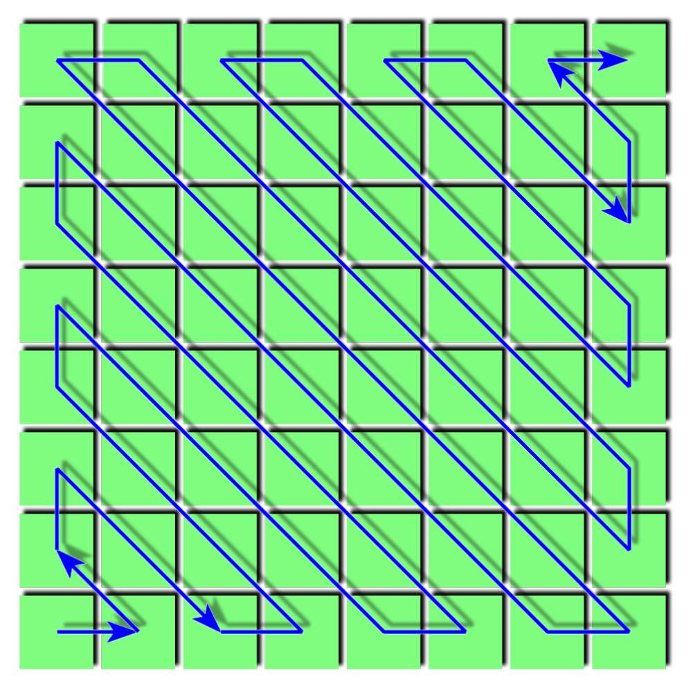
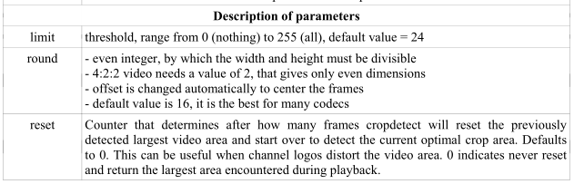
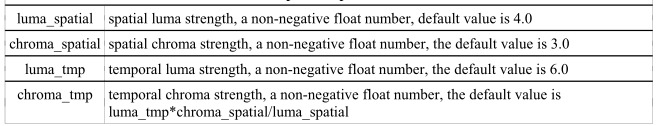
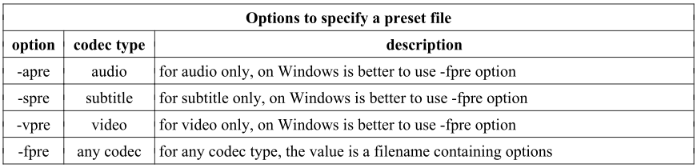
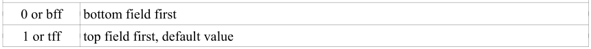
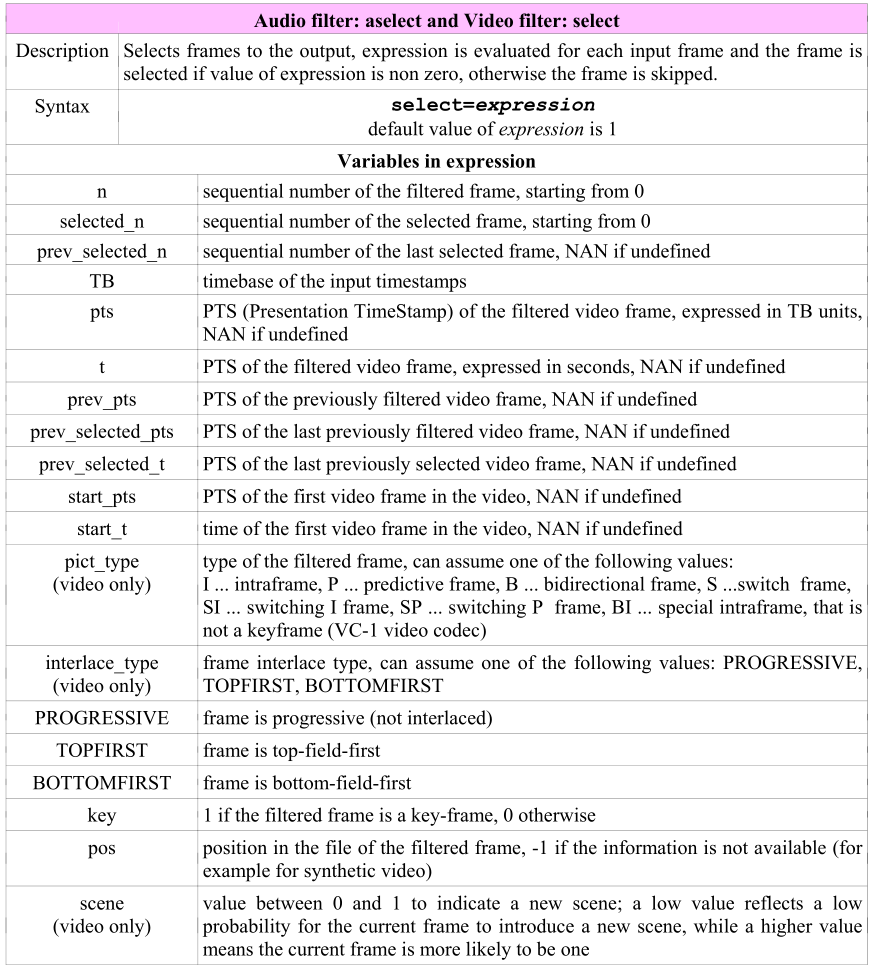
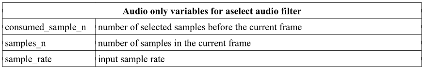
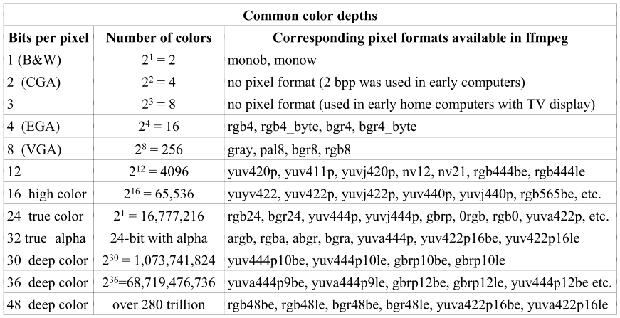
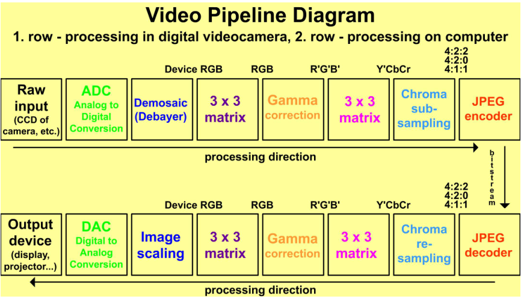

## ffmpeg

> 参考链接：
>
> [ffmpeg官网](https://ffmpeg.org/)
>
> [ffmpeg+SDL](http://dranger.com/ffmpeg/tutorial01.html)
>
> [http://trac.ffmpeg.org/wiki](http://trac.ffmpeg.org/wiki)

 

| FFmpeg command-line tools |                                                              |
| ------------------------- | ------------------------------------------------------------ |
| ffmpeg                    | fast audio and video encoder/decoder                         |
| ffplay                    | media player                                                 |
| ffprobe                   | shows media files characteristics                            |
| ffserver                  | broadcast server for multimedia streaming using HTTP and RTSP protocols |

| FFmpeg software libraries |                                                |
| ------------------------- | ---------------------------------------------- |
| libavcodec                | software library for various multimedia codecs |
| libavdevice               | software library for devices                   |
| libavfilter               | software library containing filters            |
| libavformat               | software library for media formats             |
| libavutil                 | software library containing various utilities  |
| libpostproc               | software library for post processing           |
| libswresample             | software library for audio resampling          |
| libswscale                | software library for media scaling             |

## 基础

### 命令行语法

**ffmpeg [global options] [input file options] -i input_file [output file options] output_file**


### 输出预览

**ffmpeg -i input_file ... test_options ... output_file**	使用同样的参数执行ffmpeg之前，预览效果

- 使用ffplay

  **ffplay -i input_file ... test_options** 		

- 使用sdl

  **[-icon_title i_title] [-window_size w_size] [-window_title w_title] -f sdl output**

  例如 ***ffmpeg -f lavfi -i rgbtestsrc -pix_fmt yuv420p -f sdl Example***

### 数值后缀

定义SI prefixes


例如 **ffmpeg -i input.avi -b:v 1500K output.mp4**

### 转码


### 滤镜

filters, filterchains and filtergraphs

**video filter  *"-vf"***    **audio filter  *"-af"***

> **ffplay -f lavfi -i testsrc -vf transpose=1**      顺时针旋转90°
>
> **ffmpeg -i input.mp3 -af atempo=0.8 output.mp3**   减慢音频节奏为80%


#### 利用filtergraph简化指令

> **ffmpeg -i input.mpg -vf hqdn3d,pad=2*iw output.mp4**
> **ffmpeg -i output.mp4 -i input.mpg -filter_complex overlay=w compare.mp4**
>
> 转化为一条指令
>
> **ffplay -i input.mpg -vf "split\[a\]\[b\];\[a\]pad=2*iw\[A\];\[b\]hqdn3d\[B\];\[A\]\[B\]overlay=w"**

#### link labels


> ffplay.exe -f lavfi -i rgbtestsrc -vf "split\[a\]\[b\];\[a\]pad=2*iw\[1\];\[b\]vflip\[2\];\[1\]\[2\]overlay=w"

### 媒体流的选择

一些媒体包含不同类型的媒体流。ffmpeg可识别5种  ***audio (a), attachment (t), data (d), subtitle (s), video (v)***

#### 语法

> **-map file_number:stream_type[:stream_number]**
>
> -map 0		选择所有流
>
> -map i:v	选择第i个文件的所有视频流   -map i:a     -map i:s
>
>  -an, -vn, -sn 	排除所有音频流、视频流、字幕流


#### stream specifiers 格式

| 标识符格式                  | 描述                   |
| --------------------------- | ---------------------- |
| stream_index                | 按索引方式选择         |
| stream_type[:stream_index]  | 根据类型及相应索引选择 |
| p:program_id[:stream_index] | 根据节目id             |
| stream_id                   | 根据流id               |

> **ffmpeg -i input.mpg -b:a 128k -b:v 1500k output.mp4**

### lavfi虚拟设备

是libavfilter virtual input device，通常用来显示测试模板

> ***-f lavfi [-graph[ -graph_file]]***

| lavfi option |                                                           |
| ------------ | --------------------------------------------------------- |
| -graph       | 作为输入的filtergraph，每个视频输出都标识为"outN"         |
| -graph_file  | 被读取的filtergraph文件名，发送给其他filter，语法同-graph |

> **ffplay -f lavfi -i smptebars**
>
> **ffplay -f lavfi -i color=c=blue**

### 颜色

- W3C标准颜色名字
-  0xRRGGBB[@AA]
-  #RRGGBB@0xAA
- random


## 显示帮助

| 基本                                     | 特定                           |
| ---------------------------------------- | ------------------------------ |
| ffmpeg -? ; ffmpeg -h                    | ffmpeg -h decoder=decoder_name |
| 扩展                                     | ffmpeg -h encoder=encoder_name |
| ffmpeg -h long ； ffmpeg -h full         | ffmpeg -h demuxer=demuxer_name |
| ffmpeg –? topic ； ffmpeg -h topic       | ffmpeg -h muxer=muxer_name     |
| ffmpeg -help \| more ; ffmpeg -h \| more |                                |

> ffmpeg -bsfs // 位流滤镜
>
> ffmpeg -codecs
>
> ffmpeg -decoders
>
> ffmpeg -encoders
>
> ffmpeg -filters
>
> ffmpeg -formats
>
> ffmpeg -layouts // 音频通道布局
>
> ffmpeg -L
>
> ffmpeg -pix_fmts
>
> ffmpeg -protocols
>
> ffmpeg -sample_fmts  // 音频采样格式
>
> ffmpeg -version

## 帧率、位率、文件大小

### 帧率

FPS，单位为Hz。分为逐行扫描(progressive)和隔行扫描(interlaced)帧率，如720i ，720p。

隔行帧率用在电视，如NTSC使用60i fps，即每秒60个隔行场，30帧。 PAL 和 SECAM 使用50i fps，即50个隔行场，每秒25帧。

逐行帧率24p，25p，30p用在电影工业， 50p/60p 用在高端HDTV产品


#### 设置帧率

- 使用 -r 

  **ffmpeg -i input -r fps output**

- 使用filter

  **fps=fps=number_of_frames**

  **ffmpeg -i clip.mpg -vf fps=fps=25 clip.webm**

#### 帧率预定值

| Abbreviation       | Exact value | Corresponding FPS |
| ------------------ | ----------- | ----------------- |
| ntsc-film          | 24000/1001  | 23.97             |
| film               | 24/1        | 24                |
| pal, qpal, spal    | 25/1        | 25                |
| ntsc, qntsc, sntsc | 30000/1001  | 29.97             |

> **ffmpeg -i input.avi -r 29.97 output.mpg**
> **ffmpeg -i input.avi -r 30000/1001 output.mpg**
> **ffmpeg -i input.avi -r ntsc output.mpg**

### 位率

位率类别


#### 设置位率

使用VBR，快速运动部分使用更多的bit，静态部分使用更少的	

> **ffmpeg -i film.avi -b 1.5M film.mp4**
> **ffmpeg -i input.avi -b:v 1500k output.mp4     -b:a**

#### 设置CBR

通常CBR用于实时视频流，且 -b  -minrate  -maxrate  必须一致。同时-maxrate 需同时有  -bufsize指定文件大小

> **ffmpeg -i in.avi -b 0.5M -minrate 0.5M -maxrate 0.5M -bufsize 1M out.mkv**

#### 设置输出文件最大大小

> **ffmpeg -i input.avi -fs 10MB output.mp4**

### 文件大小计算

> **video_size = video_bitrate * time_in_seconds / 8**
> **audio_size = sampling_rate * bit_depth * channels * time_in_seconds / 8**      // 未压缩的
> **audio_size = bitrate * time_in_seconds / 8**     // 压缩的

## 改变宽高、伸缩

### 宽高

改变视频的宽高像素

> -s wxh     -video_size wxh
>
> ffmpeg -i input_file -s 320x240 output_file

#### 预置大小

不使用具体的大小

> ffmpeg -i input.avi -s 640x480 output.avi
> ffmpeg -i input.avi -s vga output.avi


#### 细节丢失

根据奈奎斯特采样理论，要能够重建被采样信号，采样频率必须大于或等于被采样信号频率的2倍。当减小宽高时，为了不丢失小细节，细节原始大小必须大于 2/ratio。

> 800x600 (SVGA) -->640x480 (VGA). 2 pixels --> 2 * (640 / 800) = 1.6约等于 2，保留了细节
>
> 800x600 (SVGA) -->160x120 (QQVGA).2 pixels->2*(160/800)=0.4约等于0，失去了细节

### 伸缩

#### 特定放大滤镜

使用 pixel art scaling 算法放大原帧大小2倍而不丢失锐利。2xsai 表示2倍放大和插值

> -vf super2xsai
>
> ffplay -i .\source.flv -vf super2xsai

#### scale滤镜

输出宽高比改变，显示宽高比不变

> scale=width:height[:interl={1|-1}]

宽高参数


> ffmpeg -i input.mpg -s 320x240 output.mp4
> ffmpeg -i input.mpg -vf scale=320:240 output.mp4

#### 按比例改变 

> ffmpeg -i input.mpg -vf scale=iw/2:ih/2 output.mp4
>
> ffmpeg -i input.mpg -vf scale=iw*0.9:ih*0.9 output.mp4
>
> ffmpeg -i input.mpg -vf scale=iw/PHI:ih/PHI output.mp4
>
> 黄金比例     PHI = 1.61803398874989484820...

#### 预置缩放

> ffmpeg -i input.avi -vf scale=400:400/a         a 为aspect
>
> ffmpeg -i input.avi -vf scale=300*a:300

## 剪裁视频

### 基础

裁剪左上角x,y，宽高ow oh的区域；keep_aspect，输出SAR (sample aspect ratio)会改变来补偿新的DAR (display aspect ratio)

> crop=ow[:oh[:x[:y[:keep_aspect]]]]

ow oh 参数


> ffmpeg -i input -vf crop=iw/3:ih:0:0 output
> ffmpeg -i input -vf crop=iw/3:ih:iw/3:0 output
> ffmpeg -i input -vf crop=iw/3:ih:iw/3*2:0 output


### 裁剪中部

> x default = ( input width - output width)/2
> y default = ( input height - output height)/2
>
> ffmpeg -i input_file -vf crop=w:h output_file
> ffmpeg -i input.avi -vf crop=iw/2:ih/2 output.avi

### 自动检测裁剪区域

检测非黑色区域

> cropdetect[=limit[:round[:reset]]]
>
> ffmpeg -i input.mpg -vf cropdetect=limit=0 output.mp4



### 裁剪时钟

> ffmpeg -f lavfi -i testsrc -vf crop=29:52:256:94 -t 10 timer1.mpg


## 视频填充

用color填充区域(x,y,width,heigh)

> pad=width[:height[:x[:y[:color]]]]


> ffmpeg -i photo.jpg -vf pad=860:660:30:30:pink framed_photo.jpg

### 4:3->16:9

> ffmpeg -i input -vf pad=ih*16/9:ih:(ow-iw)/2:0:color output

### 16:9->4:3

> ffmpeg -i input -vf pad=iw:iw*3/4:0:(oh-ih)/2:color output

### 任意大小填充

- Pillarboxing 水平填充

> ffmpeg -i input -vf pad=ih*ar:ih:(ow-iw)/2:0:color output

- Letterboxing 垂直填充

> ffmpeg -i input -vf pad=iw:iw*ar:0:(oh-ih)/2:color output

## 翻转和旋转

### 水平翻转

> -vf hflip
>
> ffplay -f lavfi -i testsrc -vf hflip

### 垂直翻转

> -vf vflip
>
> ffplay -f lavfi -i rgbtestsrc -vf vflip

### 旋转

> transpose={0, 1, 2, 3}
>
> 0 ：逆时针90° 且垂直翻转	等价 transpose=2,vflip
> 1 ：顺时针旋转90°
> 2 ：逆时针90° 
> 3 ：顺时针90° 且垂直翻转	等价transpose=1,vflip

## 模糊、锐利、去噪

### 模糊

均值模糊，r 半径，p 是power

> boxblur=luma_r:luma_p[:chroma_r:chroma_p[:alpha_r:alpha_p]]


> ffmpeg -i input.mpg -vf boxblur=1.5:1 output.mp4


> smartblur=luma_r:luma_s:luma_t[:chroma_r:chroma_s:chroma_t]
>
>  r = radius, p = power, t = threshold


### 锐化

用于去锐化模板和高斯模糊

> unsharp
>
> l_msize_x:l_msize_y:l_amount:c_msize_x:c_msize_y:c_amount
> 默认是 5:5:1.0:5:5:0.0
>
> ffmpeg -i input -vf unsharp=6:6:3 output.mp4
>
> ffmpeg -i input -vf unsharp=7:7:-2 output.mp4   // -2 高斯模糊


### 降噪

创建更高质量、更易压缩的视频

- denoise3d

	> mp=denoise3d[=luma_spatial[:chroma_spatial[:luma_tmp[:chroma_tmp]]]]

	

	> ffmpeg -i input.mpg -vf mp=denoise3d output.webm

- hqdn3d

   high quality denoise 3-dimensional
   
   > hqdn3d=[luma_spatial[:chroma_spatial[:luma_tmp[:chroma_tmp]]]]
   
   
   
- nr

   noise reduction，范围为0-100000，通常1-600。越密集的噪点值越大

## 叠加PIP

第二个输入叠加到第一个输入上

> overlay[=x:y[[:rgb={0, 1}]]
>
> ffmpeg -i input1 -i input2 -filter_complex overlay=x:y output


或 `ffmpeg -i input1 -vf "movie=input2[logo];[in][logo]overlay=x:y" output`


### 在特定时间显示

>  -itsoffset 		input timestamp offset
> 在五秒后显示logo
> ffmpeg -i video_with_timer.mp4 -itsoffset 5 -i logo.png -filter_complex overlay timer_with_logo.mp4

## 添加文字

> drawtext=fontfile=font_f:text=text1[:p3=v3[:p4=v4[...]]]         p3 v3 p4 v4等为参数


> ffplay -f lavfi -i color=c=white -vf drawtext=fontfile=/Windows/Fonts/arial.ttf:text=Welcome

### 设置位置

> ffplay -f lavfi -i color=c=white -vf drawtext="fontfile=arial.ttf:text='Good day':x=(w-tw)/2:y=(h-th)/2"
>
> ffplay -f lavfi -i color=c=white -vf drawtext="fontfile=arial.ttf:text='Happy Holidays':x=(w-tw)/2:y=(h-th)/2:fontcolor=green:fontsize=30"
>
> ffplay -f lavfi -i color=c=blue -vf drawtext="fontfile=arial.ttf:text='Happy Holidays':x=(w-tw)/2:y=(h-th)/2:fontcolor=yellow:fontsize=40"

### 动态文本

随着时间而改变文字的x,y

> ffmpeg -f lavfi -i color=c=#abcdef -vf drawtext="fontfile=arial.ttf:text='Dynamic RTL text':x=w-t*50:fontcolor=darkorange:fontsize=30" output
>
> ffplay.exe -f lavfi -i color=c=orange -vf drawtext="fontfile=/Windows/Fonts/YaHei.Consolas.1.12.ttf:textfile=info.txt:x=w-t*50:y=h-th:fontcolor=blue:fontsize=30"

## 格式转换


> ffmpeg -i input.avi -q 1 -c copy output.mov
>
>  -c copy or -c:a copy or -c:v copy   改变容器格式但不改变编码格式
>
>  -codec copy

### 转码和转换

只改变容器格式或只改变编码格式，或值改变携带的数据，改变压缩或不压缩


### 编解码器

> -codec[:stream_specifier] codec_name          或 -c 


> ffmpeg -y -i input.avi output.mp4      -y 输入yes

### 通用转换选项


> -q    or    -qscale[:stream_specifier]   保持输出质量1-31，1为最高质量

### 私有转换选项

- MPEG-1 video encoder

  

- MPEG-2 video encoder

  

- MPEG-4 video encoder

  data_partioning
  alternate_scan
  mpv_flags
  luma_elim_threshold
  chroma_elim_threshold
  quantizer_noise_shaping

- libvpx video encoder

  WEBM

  

- AC-3 audio encoder

  

### VCD, SVCD, DVD, DV , DV50

VCD=Video CD, SVCD=Super Video CD, DV=Digital Video

> -target
>
> ffmpeg -i input.avi -target dvd output.mpg
>
> 可选值
>
> vcd, pal-vcd, ntsc-vcd, film-vcd
> svcd, pal-svcd, ntsc-svcd, film-svcd
> dvd, pal-dvd, ntsc-dvd, film-dvd
> dv, pal-dv, ntsc-dv, film-dv
> dv50, pal-dv50, ntsc-dv50, film-dv50

## 时间操作

改变输入文件时长，设置延迟，选择输入固定时间段。

> [-]HH:MM:SS[.m...]
> [-]S+[.m...]

### 音频和视频时长

- -t 

  > ffmpeg -i music.mp3 -t 180 music_3_minutes.mp3

- 设置总帧数

  > audio: -aframes number or -frames:a number
  > data: -dframes number or -frames:d number
  > video: -vframes number or -frames:v number
  >
  > ffmpeg -i video.avi -vframes 15000 video_10_minutes.avi

### 设置延迟

> -ss (seek from start)   设置时间
>
> ffmpeg -i input.avi -ss 10 output.mp4

### 截取一段

> ffmpeg -i video.mpg -ss 240 -t 60 clip_5th_minute.mpg

### 多个流间延迟

> ffmpeg -i input.avi -ss 1 audio.mp3
> ffmpeg -i input.avi -i audio.mp3 -map 0:v -map 1:a video.mp4
>
> ffmpeg -i input.mov -map 0:v -map 0:a -itsoffset 1.5 -c:a copy -c:v copy output.mov  延迟播放音频1.5s
>
> ffmpeg -i input.mov -map 0:v -itsoffset 5 -map 0:a -c:a copy -c:v copy output.mov   延迟视频5s
>
> ffmpeg -i v.mpg -itsoffset 3 -i a.mp3 -map 0:\v:0 -map 1:\a:0 output.mp4

### 设置命令执行时间

> -timelimit
>
> ffmpeg -i input.mpg -timelimit 600 output.mkv

### 根据最短流决定时间

>  -shortest
>
> ffmpeg -i video.avi -i audio.mp3 -shortest output.mp4

### 时间戳和时间基

- 时间戳

    > -timestamp
    >
    > 值可为：
    > now 、YYYY-MM-DD or YYYYMMDD、 HH:MM:SS[.m...] or HHMMSS[.m...]
    > T or t 可选的放在时间之前，Z or z放在后边表是UTC时间，否则为本地时间，如
    >
    >  2010-12-24T12:00:00, 20101224t120000z, 20101224120000
    
- 时间基

     tbr, tbn, tbc 三种不同的时间基

    

### 设置编码器时间基

>  -copytb mode
>
>  mode=1  使用解复用器时间基
>  mode=0  使用解码器时间基
>  mode=-1 自动选择
>
>  ffmpeg -i input.mp4 -copytb 1 output.webm

### 音视频速度修改

- setpts=expression （set presentation timestamp）

  

  > ffplay -i input.mpg -vf setpts=PTS/3  加速三倍	

- atempo[=tempo]

  

  > ffplay -i .\source.flv -vf setpts=PTS/2 -af atempo=2

### 使用时间戳同步音频

通过压缩和丢采样或者伸长和添加静默片段来同步

> asyncts=parameters


> ffmpeg -i music.mpg -af asyncts=compensate=1 -f mpegts music.ts

## 数学函数


### 内建代数运算


### 内建常量


> ffplay -f lavfi -i aevalsrc=sin(523.251\*2\*PI\*t)     发出  C5 pitch (tenor high C) 音
> ffplay -f lavfi -i aevalsrc=cos(523.251\*2\*PI\*t)

 "expr1;expr2" 按顺序执行表达式


> ffplay -f lavfi -i color=c=orange -vf drawtext=fontfile=/Windows/Fonts/arial.ttf:fontcolor=white:fontsize=20:text="5 seconds delayed text":x=(w-tw)/2:y=(h-th)/2:draw=gt(t\,5)

## 元数据和字幕

### metadata

mp3文件种通常包含歌曲名、艺术家、专辑等信息。

> ffplay -i source.mp3
>
> -metadata key=value  添加元数据，可同时添加多个
>
> ffmpeg -i input -metadata artist=FFmpeg -metadata title="Test 1" output


> ffmpeg -i video.avi -metadata location="London, United Kingdom" -metadata "camera type"="SONY DSC" -metadata "camera mode"=movie -metadata weather="sunny" video.wmv

#### 保存或加载元数据

> ffmpeg -i video.wmv -f ffmetadata data.txt
>
> ffmpeg -i data.txt -i video1.avi video1.wmw

#### 删除元数据

> ffmpeg -i input.avi -map_metadata -1 output.mp4    设置负值即可

### subtitles

> ffmpeg -i subtitles.srt subtitles.ass


#### 编码字幕

> -vf ass
>
> -vf subtitles=filename[:original_size]
>
> ffmpeg -i video.avi -vf subtitles=titles.srt video.mp4


Windows 下使用

>  fonts.conf  和ffmpeg 放置在一起，且添加如下环境变量
>
> 

## 图像处理


### 创建图像

#### 视频截图

> ffmpeg -i input -ss t image.type
>
> ffmpeg -i videoclip.avi -ss 01:23:45 image.jpg

#### 创建GIF

> ffmpeg -i promotion.swf -pix_fmt rgb24 promotion.gif
>
> 存储了未压缩的图像，所以输入一般是较小分辨率的

#### 从内建视频创建


> mptestsrc 是 512x512，其他事320x240

##### color

> color[=c=clr[:d=time[:r=fps[:sar=value[:s=resolution]]]]]
>
> ffmpeg -f lavfi -i color=c=#008080:s=728x90 leaderboard.jpg


#### 视频转换为图像

> ffmpeg -i clip.avi frame%d.jpg
>
> ffmpeg -i clip.avi frame%4d.jpg

### 大小、剪裁、填充图像

> ffmpeg -f lavfi -i color=c=orange:s=cif orange_rect1.png
> ffmpeg -f lavfi -i color=c=orange -s cif orange_rect2.png
>
> ffmpeg -f lavfi -i rgbtestsrc -vf crop=150:150 crop_rgb.png
>
> ffmpeg -f lavfi -i smptebars -vf pad=360:280:20:20:orange pad_smpte.jpg

### 翻转、旋转、叠加图像

> ffmpeg -i orange.jpg -vf hflip orange_hflip.jpg
> ffmpeg -i orange.jpg -vf vflip orange_vflip.jpg
>
> ffmpeg -i image.png -vf transpose=1 image_rotated.png
>
> ffmpeg -f lavfi -i rgbtestsrc -s 400x300 rgb.png
> ffmpeg -f lavfi -i smptebars smpte.png
> ffmpeg -i rgb.png -i smpte.png -filter_complex overlay=(W-w)/2:(H-h)/2 rgb_smpte.png

### 图像类型转换

> ffmpeg -i image.type1 image.type2
>
> ffmpeg -i illustration.png illustration.jpg

### 从图像创建视频

- 一张图片

  > ffmpeg -loop 1 -i photo.jpg -t 10 photo.mp4

- 多张图片

  图片最后是数字，设置帧率

  > ffmpeg -f image2 -i img%d.jpg -r 25 video.mp4
  >
  > ffmpeg -f image2 -i img%3d.jpg -r 25 video.mp4

## 数字音频

采集、录制、编辑、编码、重建音频信号。位流一般以PCM方式编码。

人耳听到的声音分为声调和噪音。前者由由规律的物质振动产生，后者由不规则振动产生。机械振动以压力波的形式传递到听觉系统，被耳膜接收并被转化为神经信号。


### 量化和采样


### 文件格式


### 声音合成

有规律的声音振动可以用不同振幅和频率的正余弦波表示


> **aevalsrc=exprs[::options]**


C1 to B8 声调，人类声调是 E2 (male bass) to C6 (female soprano)。A4音符的音高标准


> ffmpeg -f lavfi -i aevalsrc=sin(440*2*PI*t) -t 10 noteA4.mp3

### 立体声和复杂声音

声道位置 

>  -layout  xxx


> ffplay -f lavfi -i aevalsrc=sin(261.63*2*PI\*t):cos(523.25*2*PI\*t)::c=FL+FR
>
> ffplay -f lavfi -i aevalsrc="sin(261.63*2*PI*t)|cos(523.25*2*PI*t):c=FL+FR"

### 减压的双耳音调

一种特殊类型的立体声，两个频率差小于30Hz或更小的声调，且两个声调的频率都小于1000Hz。使用立体声耳机听双耳音调会有减压的效果，提高学习能力，增强大脑某些功能。基频和频差的不同效果不同。

> ffplay -f lavfi -i aevalsrc=sin(495*2*PI*t):sin(505*2*PI*t)::c=FL+FR

### 音量设置

> -vol xxx    0~256    -volume 0-100
>
> ffmpeg -i sound.wav -vol 180 sound_middle_loud.wav
>
> -af volume=vol
>
> vol 为十进制数时  output_volume = vol * input_volume
> vol 为xxdB时，output_volume = 10^(vol/20) * input_volume
>
> ffmpeg -i music.wav -af volume=2/3 quiet_music.wav
> ffmpeg -i sound.aac -af volume=10dB louder_sound.aac

### 混合声音

 Audio mixer，混合多输入来创建特定时长的声音。

> -filter_complex amix=inputs=ins[:duration=dur[:dropout_transition=dt]]


> ffmpeg -i sound1.wav -i sound2.wav -i sound3.wav -i sound4.wav -filter_complex amix=inputs=4:dropout_transition=5 sounds.wav

### 立体声转为单声道、多声道转为立体声

> -af pan=layout:channel_def[:channel_def[:channel_def...]]


> ffmpeg -i stereo.wav -af pan=1:c0=0.5\*c0+0.5\*c1 mono.wav   变为单声道，音量不变
> 或
> ffmpeg -i stereo.wav -af pan=mono mono.wav
> ffmpeg -i stereo.wav -af pan=1 mono.wav
>
> ffmpeg -i stereo.wav -af pan=1:c0=0.6*c0+0.4*c1 mono.wav  左边声音大
>
> ffmpeg -i surround.wav -af pan=stereo:FL<FL+0.5\*FC+0.6\*BL+0.6\*SL:FR<FR+0.5\*FC+0.6\*BR+0.6\*SR stereo.wav
>
> -ac[:stream_specifier]  多声道转化未特定声道
>
> ffmpeg -i 5_1_surround_sound.wav -ac 2 stereo.wav

### 简单音频分析器

> -af ashowinfo


> ffmpeg -report -i audio.wav -af ashowinfo -f null /dev/null

### 增加立体感

将立体位置从标准耳机变到外部，和前部。对CD（44.1kHz）有效，因为插入了特殊的标记

> -af earwax
>
> ffmpeg -i music.mp3 -af earwax -q 1 music_headphones.mp3

### -map_channel

改变音频参数

> -map_channel \[in_file_id.stream_spec.channel_id|-1\]\[:out_file_id.stream_spec\]
>
> 1，如果未设置out_file_id.stream_spec，则映射所有流
>
> 2，如果使用-1，静音通道被映射
>
> 3，-map_channel的顺序决定了输出流里的通道顺序
>
> 4，同时使用-ac ，如果输入和输出layout不一致，通道增益会改变

#### 交换立体声声道

> ffmpeg -i stereo.mp3 -map_channel 0.0.1 -map_channel 0.0.0 ch_switch.mp3

#### 分离立体声声道

> ffmpeg -i stereo.mp3 -map 0:0 -map 0:0 -map_channel 0.0.0:0.0 -map_channel 0.0.1:0.1 output.aac

#### 静音立体声声道

> ffmpeg -i stereo.mp3 -map_channel -1 -map_channel 0.0.1 mono.mp3

### 合并2个流为1个多声道流

输入文件的采样率和文件格式需一样，输出总时长为最短输出文件时长

> ffmpeg -i mono1.mp3 -af amovie=mono2.mp3[2];\[in\]\[2\]amerge stereo.mp3

### 流同步

> -af astreamsync[=expr]  默认值是 t2-t1
>
> if expr < 0, the first stream is forwarded, otherwise is forwarded the second one


## 编解码器预设

preset 预设文件，包含特定编解码器的许多选项。每一行是键值对或#注释



>  ffmpeg -i input -fpre mpeg2.ffpreset -q 1 MPEG2_video.mpg  其中 mpeg2.ffpreset 包含vcodec=mpeg2video

例如

> ffmpeg -i input.avi -vcodec flv -f flv -r 29.97 -vf scale=320:240 -aspect 4:3 -b:v 300k -g 160 -cmp dct -subcmp dct -mbd 2 -flags +aic+mv0+mv4 -trellis 1 -ac 1 -ar 22050 -b:a 56k output.flv
>
> 等价 flv.ffpreset
>
> vcodec=flv (video codec)
> b:v=300k (video bitrate)
> g=160 (group of picture size)
> mbd=2 (macroblock decision algorithm)
> flags=+aic+mv0+mv4 (aic - h263 advanced intra coding; always try a mb with
> mv=<0,0>; mv4 - use 4 motion vector by macroblock)
> trellis=1 (rate-distortion optimal quantization)
> ac=1 (number of audio channels)
> ar=22050 (audio sampling rate)
> b:a=56k (audio bitrate)
>
> ffmpeg -i input.avi -f flv -r 29.97 -vf scale=320:240 -aspect 4:3 -cmp dct -subcmp dct -fpre flv.ffpreset output.flv

## 隔行视频

隔行技术是为了消除黑白模拟电视的在旧显示器上的闪烁而发展的。视频帧被水平分割成规则的行，二个场。第一个场包含奇数行，第二个场包含偶数行

### NTSC, PAL, SECAM

NTSC标准，525行中有483行可见，60Hz，60场，30fps，其他用来同步、垂直回扫。PAL和SECAM 标准625行，50Hz，50场，25fps


### 设置隔行帧类型

标记输出帧的隔行标记，帧的内容不变

> -vf setfield=type
>
> ffmpeg -i input.vob -vf setfield=tff output.mov


### 改变场序

改变上场和下场顺序，内容会上下改变一行

> -vf fieldorder[=order_type]
>
> ffmpeg -i dvd.vob -vf fieldorder=0 output.dv



### 去隔行

yadif (yet another deinterlacing filter)，质量会变低，无法完全重建内容。

> -vf yadif[=mode[:parity[:auto]]]
>
> ffmpeg -i movie.avi -vf yadif movie-progressive.mov
>
> 或  -deinterlace
>
> ffmpeg -i input.mpg -vf mp=ivtc output.mp4


### 数字电视标准


## ffmpeg 组件和项目

### ffplay

> ffplay [options] [input_file]
>
> ffplay -f lavfi -i testsrc -vf pad=400:300:(ow-iw)/2:(oh-ih)/2:orange
>
> ffplay -i lavfi "movie=document.avi[out0];amovie=comments.mp3[out1]

#### 按键


#### 显示模式

w按键切换视频、inverse Real Discrete Fourier Transform、波形

> -showmode


### ffprobe

> ffprobe [options] [input_file]


### ffserver

> ffserver [options]


### 库


## 麦克分和网络摄像头

### 输入设备

> dshow
>
> options type=media_type[:type=media_type]


> ffmpeg -list_devices 1 -f dshow -i dummy   //列举设备
>
> ffmpeg -list_options true -f dshow -i video="USB2.0 HD UVC WebCam" //列举设备支持的选项

### 显示和录制

> ffplay -f dshow -i video="USB2.0 HD UVC WebCam"
>
> ffmpeg -f dshow -i video="USB2.0 HD UVC WebCam" -pix_fmt yuv420p -f sdl example
>
> ffmpeg -f dshow -i video="USB2.0 HD UVC WebCam" webcam.avi
>
> ffplay -f dshow -video_size qvga -i "video=USB2.0 HD UVC WebCam"

### 显示两个webcam

> ffmpeg -f dshow -i "video=USB2.0 HD UVC WebCam" -f dshow -video_size qvga -i "video=USB2.0 HD UV
> C WebCam" -filter_complex overlay -f sdl "2 webcams"

### 录制声音

> ffmpeg -list_options 1 -f dshow -i "audio=Microphone (Realtek High Defini"  
>
> ffplay -f dshow -i audio=" Microphone (Realtek High Defini "  // 播放
>
> ffmpeg -f dshow -i audio=" Microphone (Realtek High Defini " -t 60 mic.mp3  // 录制
>
> ffmpeg -f dshow -i audio="Microphone (Realtek High Defini":video="HP Webcam" webcam_with_sound.avi   //同时录制视频和声音

## windows batch

|            |                                                              |
| ---------- | ------------------------------------------------------------ |
| @          | 放在一行的开头，关闭回显。@echo off                          |
| %n         | n自然数字，表是第几个输入参数                                |
| :label     | GOTO语句跳转点                                               |
| call       | call \[drive\]\[path\] filename \[batch parameters\]。调用额外batch文件，没有文件将出错 |
| choice     | CHOICE \[/C\[:\]choices] \[/N\] \[/S\] \[/T\[:\]c,nn\] \[text\]。<br/>/C\[:\]choices Specifies allowable keys. Default is YN.<br/>/N Does not display choices and ? at end of prompt string.<br/>/S Treats choice keys as case sensitive.<br/>/T\[:\]c,nn Defaults choice to c after <nn> seconds. |
| cls        | 清除屏幕和输出                                               |
| echo       | echo on\|off   打开或关闭回显   echo string   打印string     |
| for        | 对文件集合操作。<br/>FOR %%variable IN (set) DO command [CommandLineOptions]<br/>%variable 参数占位符<br/>(set)  定义单个或多个文件集合<br/>command command-parameters  命令和参数<br/>FOR %%F IN (*.txt) DO type %%F    ; 命令行中用%f |
| goto label | 跳转到label处执行                                            |
| if         | IF [NOT] ERRORLEVEL number command<br/>IF [NOT] string1==string2 command<br/>IF [NOT] EXIST filename command<br/>ERRORLEVEL number  如果上一个返回的exit值大于或等于number，则为真 |
| pause      | 暂停执行流程                                                 |
| rem        | REM [comment]  注释                                          |
| shift      | SHIFT [n]  n是自然数。重定位输入参数位置。如shift First Second<br/>@ECHO OFF<br/>ECHO %1<br/>SHIFT<br/>ECHO %1<br/>输出 First First |
| start      | START \["title"\] \[/Dpath\] \[/I\] \[/MIN\] \[/MAX\]\[/SEPARATE\|/SHARED\]\[/LOW \| /NORMAL \| /HIGH \| /REALTIME \| /ABOVENORMAL \| /BELOWNORMAL\]\[/WAIT\]\ [/B\] \[command/program\][parameters]<br/>为特定指令开启一个新的窗口 |

> @echo off
> set /p i=Please enter the name of input file:
> set /p o=Please enter the name of output file without MP3 extension:
> ffmpeg -i %i% -b:a 128k -ar 44100 %o%.mp3
> ffplay %o%.mp3

### 音调发生器

> @echo off
> set /p n=Please enter the note name:
> set /p f=Please enter the frequency:
> set /p d=Please enter the duration in seconds:
> ffmpeg -f lavfi -i aevalsrc=sin(%f%*2*PI*t) -t %d% tone%n%
> copy /b tone%n%%d%.mp3+silence.mp3 tone%n%_%d%.mp3

## 颜色校正

即图像编辑，如亮度调整、颜色平衡、伽马校正、色调、饱和度等

### 使用LUT编辑视频

视频滤镜   lut, lutrgb, lutyuv
lut  创建一个LUT将输入的颜色值每个通道映射到输出颜色相应通道，并作用域输入视频。输入YUV或RGB
lutrgb lutyuv 分别指定输如RGB 和 YUV

> lut=[c0=expr[:c1=expr[:c2=expr[:c3=expr]]]]
> lutrgb=[r=expr[:g=expr[:b=expr[:a=expr]]]]
> lutyuv=[y=expr[:u=expr[:v=expr[:a=expr]]]]


#### 转换为黑白图片

> ffplay -f lavfi -i smptebars -vf lut=c1=128:c2=128
> ffplay -f lavfi -i smptebars -vf lutyuv=u=128:v=128

### 颜色空间简介

RGB和YUV颜色空间比较


RGB三原色可以组成所有颜色，YUV及YCbCr是基于人眼对绿色更敏感定义的颜色空间。Y是伽马校正后绿色的亮度，Cr是红色减去亮度的色度，Cb是蓝色减去亮度的色度。

### YUV、YCbCr

luma或luminance是图片去掉色差的部分，即亮度。luma用于视频工程，luminance用于颜色理论（CIE, ICC等等）。


chroma和chrominance表明图片的颜色部分。

> U = B' - Y' or U = Cb (blue color - luma)
>
> V = R' - Y' or V = Cr (red color - luma)

### 像素格式

常用像素格式 rgb8, rgb24, rgba, yuv420p, yuv422p等

> ffplay -f lavfi -i rgbtestsrc -vf lutrgb=r=0:g=0

### 色度和饱和度设置

表示RGB颜色空间， HSB (HSV)，hue-saturation-brightness (hue-saturation-value) color space。使用圆柱左边系统。

HSB对应的媒介是眼睛的感受细胞。HSB是基于人眼的视觉接受体系的色彩空间描述。平常表述颜色时，一般用的就是HSB模式，因为人眼看到的就是色度、饱和度、明度。

  

- H：色度，用于调整颜色，范围在0~360度之间。 

  在0~360°的标准色环上，按照角度值标识。比如红是0°、橙色是30°等 

- S：饱和度，范围在0%~100%之间，0%为灰色，100%为纯色。 

  指颜色的强度或纯度。饱和度表示色度中彩色成分所占的比例，用从0%(灰色)~100%(完全饱和)的百分比来度量。在色立面上饱和度是从内向外逐渐增加 

- B：亮度，范围在0%~100%之间，0%为黑色，100%为白色。 

   颜色的明暗程度，通常是从0(黑)~100%(白)的百分比来度量的，在色立面中从上至下逐渐递减，上边线为100%，下边线为0% 。 


> ffplay -i .\test01.jpeg -vf hue=180
>
> ffplay -i .\test01.jpeg -vf hue=s=10


> ffplay -f lavfi -i testsrc -vf split\[1\]\[2\];\[1\]pad=iw*2\[A\];\[2\]lutrgb=g=256\[B\];\[A\]\[B\]overlay=w
>
> ffplay -f lavfi -i testsrc -vf "split\[1\]\[2\];\[1\]pad=iw:ih*2\[A\];\[2\]lutrgb=g=256\[B\];\[A\]\[B\]overlay=0:h"

## 高级技术

### 连接音视频


- 使用shell

  Windows下  copy /B file1+file2+...+fileN-1+fileN outputFile 

  Linux下        cat videoclip1.mpg videoclip2.mpg > video.mpg

- 使用 concat protocol

  ffmpeg -i concat:"videoclip1.mpg|videoclip2.mpg" -c copy video.mpg

- 使用concat filter

  

  > ffmpeg -i input1.avi -i input2.avi -filter_complex concat output.avi
  > ffmpeg -i input1.avi -i input2.avi -filter_complex concat output.mp4
  > ffmpeg -i input1.avi -i input2.mp4 -filter_complex concat output.webm
  > ffmpeg -i input1.avi -i input2.mp4 -i input3.mkv -filter_complex concat=n=3 output.flv
  > ffmpeg -i input1.avi -i input2.avi -i input3.avi -i input4.avi -filter_complex concat=n=4 output.mp4
  > f -i 1.avi -vf movie=2.avi\[a\];\[in\]\[a\]concat a.mp4

### 移除logo


> ffmpeg -i eagles.mpg -vf delogo=x=700:y=0:w=100:h=50:t=3:show=1 nologo.mpg
>
> ffmpeg -i eagles.mpg -vf delogo=x=730:y=0:w=70:h=46:t=1 nologo.mpg

### 去抖动


> ffmpeg -i travel.avi -vf deshake fixed_travel.avi
> ffmpeg -i travel.avi -vf deshake=contrast=160 fixed.avi
> ffmpeg -i travel.avi -vf deshake=blocksize=4:filename=log.txt fixed.avi

### 添加颜色盒子


> ffmpeg -i ship.avi -vf drawbox=x=150:w=600:h=400:c=yellow ship1.avi

### 帧数检测

> ffmpeg -i input.mpg -f null /dev/null

### 检测广告、区块平移、编码错误帧


>  ffmpeg -f lavfi -i mptestsrc -vf blackdetect -f sdl 'test'


> ffmpeg -f lavfi -i mptestsrc -vf blackframe -f sdl 'test'

### 选择特定的帧输出





> ffmpeg -i input.avi -vf select output.avi
> ffmpeg -i input.avi -vf select=1 output.avi
>
> ffplay -i .\source_960x540.flv -vf select="gte(t\,20)*lte(t\,25)" 
>
> ffplay -i .\source_960x540.flv -vf select="eq(pict_type\,I)"

### 改变宽高比

> DAR = width/height * SAR


> ffplay -i input.avi -vf setdar=r=16/9
> ffplay -i input.avi -vf setdar=16/9
> ffplay -i input.avi -vf setsar=r=1.234
> ffplay -i input.avi -vf setsar=1.234

### 抓屏

> ffmpeg -f dshow -i video="UScreenCapture" -t 60 screen.mp4

### 输出帧信息


> ffmpeg -report -f lavfi -i testsrc -vf showinfo -t 10 showinfo.mpg

### 音频频谱


> ffmpeg -i audio.mp3 -vf showspectrum audio_spectrum.mp4
>
> ffplay -i .\source_960x540.flv -vn -vf showspectrum 

### 音频波形


> ffmpeg -i music.mp3 -vf showwaves waves.mp4

### 人声综合

### 输出多种格式

### 额外媒体文件输入


> ffmpeg -i video.mpg -vf movie=logo.png\[a\];\[in\]\[a\]overlay video1.mp4
>
> ffmpeg -i video.mpg -vf movie=logo.png:sp=5[a];[in][a]overlay video1.mp4

## 网络视频

## debug和测试


> ffmpeg -debug mmco -f lavfi -i mptestsrc -t 0.5 output.mp4
>
> ffmpeg -debug_ts -f lavfi -i mptestsrc -t 0.1 output.mp4
>
> ffmpeg -fdebug ts -f lavfi -i mptestsrc -t 0.1 output.mp4

### 错误检测标指


### loglevel

 quiet, panic, fatal, error, warning, info, verbose, debug

> ffmpeg -loglevel verbose -i input.avi output.mp4
>
> ffmpeg -v verbose  -i input.avi output.mp4

### timebase配置测试


> ffmpeg input.mpg -vf settb=AVTB output.mpg
> ffmpeg input.mpg -vf settb=0.3 output.mpg
> ffmpeg input.mpg -vf settb=1.5*intb output.mpg

### 测试编码特性

### 测试模板

> ffplay -f lavfi -i rgbtestsrc
>
> ffplay -f lavfi -i testsrc
>
> ffplay -f lavfi -i testsrc

### payload dump

> ffmpeg -dump -hex -report -i input.mpg output.flv

### CPU、内存使用

-benchmark 及 -benchmark_all
-benchmark 显示编码后的结果
-benchmark_all 显示编码中的结果

> ffmpeg -benchmark -i input.avi output.webm

## 术语

### 4cc  fourcc

 Four Character Code，定义媒体文件中视频编解码器、压缩格式、颜色或像素格式。

- -vtag (or -tag:v) option sets the fourcc value for the video stream
- -atag (or -tag:a) option sets the fourcc value for the audio stream
- -tag option sets the fourcc value for all streams

### Aspect ratio

宽高比 

> DAR = PAR x SAR


### CIE

International Commission on Illumination

### Color depth, bit depth, bits per pixel



### Color models and color spaces

 CIE, CMYK, HSL/HSV, RGB and YUV

### Color vision

### DCT - Discrete Cosine Transform

### Video pipeline




## 测试

```shell
ffmpeg -f lavfi -i rgbtestsrc -pix_fmt yuv420p -f sdl Example

ffmpeg -i input.avi -b:v 1500K output.mp4

ffplay -f lavfi -i testsrc -vf transpose=1

ffmpeg -i input.mp3 -af atempo=0.8 output.mp3

ffmpeg -i input.mpg -vf hqdn3d,pad=2*iw output.mp4

ffmpeg -i output.mp4 -i input.mpg -filter_complex overlay=w compare.mp4

ffplay -i input.mpg -vf "split[a][b];[a]pad=2*iw[A];[b]hqdn3d[B];[A][B]overlay=w"

ffplay -f lavfi -i rgbtestsrc -vf "split[a][b];[a]pad=2*iw[1];[b]vflip[2];[1][2]overlay=w"

ffmpeg -i input.mpg -b:a 128k -b:v 1500k output.mp4

ffplay -f lavfi -i smptebars

ffplay -f lavfi -i color=c=blue

ffplay -f lavfi -i testsrc -vf "split[1][2];[1]pad=iw*2[A];[2]lutrgb=g=256[B];[A][B]overlay=w"

ffplay -f lavfi -i testsrc -vf "split[1][2];[1]pad=iw:ih*2[A];[2]lutrgb=g=256[B];[A][B]overlay=0:h"

ffplay -f lavfi -i testsrc -vf "split[1][2];[1]pad=iw*2,lutrgb=b=256[A];[2]lutrgb=g=256[B];[A][B]overlay=w"

ffplay -f lavfi -i testsrc -vf "split=3[1][2][3];[1]pad=iw*3[A];[2]lutyuv=u=val*1.5[B];[3]lutyuv=v=val*1.5[C];[A][B]overlay=w[D];[D][C]overlay=w*2"

ffplay -i tomato.mpg -vf "split=4[1][2][3][4];[1]pad=iw*2:ih*2[A];[2]lutrgb=r=val*2[B];[3]lutrgb=g=val*2[C];[4]lutrgb=b=val*2[D];[A][B]overlay=w[E];[E][C]overlay=0:h[F];[F][D]overlay=w:h"
```


