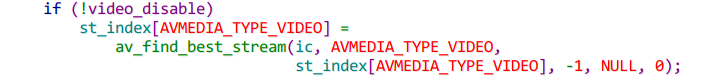

# ffmpeg源码阅读

## 简介

## libavformat

处理多种媒体容器格式。主要功能是解复用，同时也支持通过协议访问数据，如`file、tcp、http`等。

```C
"libavformat.h" libavformat主要的公共API
```

### 列举主要API

```C
av_register_all()
avformat_netwirk_init()
av_iformat_next()
av_oformat_next()
avio_enum_protocols()
```

使用之前先`av_register_all()`，注册所有包含的复用器、解复用器、协议。通常也需要`avformat_netwirk_init()`使能网络功能。

`AVInputFormat、AVOutputForamt`结构分别用来描述输入和输出格式。通过`av_iformat_next()  av_oformat_next()`迭代所有注册的格式。`avio_enum_protocols()`获取支持的协议。

`AVFormatContext` 包含文件所有可读可写的信息。通过`avformat_alloc_context()` 获取。

传递参数到解、复用器上。通用的option通过`AVFormatContext`提供，调用`av_opt_next()/av_opt_find()/avformat_get_class()`。私有的option通过`AVFormatContext.priv_data`获取。

url，通常是"protocol:xxx或file:xxx"

解复用器将媒体文件分解成数据包，`AVPacket`包含一个或多个属于一个基本流的编码帧。`avformat_open_input()` 打开文件，`av_read_frame` 读取一个包`avformat_close_input()` 关闭。`avformat_find_stream_info()` 尝试解码一些帧来获取信息

```C++
AVDictionary *options = NULL;
av_dict_set(&options, "video_size", "640x480", 0);
av_dict_set(&options, "pixel_format", "rgb24", 0);
if (avformat_open_input(&s, url, NULL, &options) < 0)
    abort();
av_dict_free(&options);
```

读取到的帧通过`avcodec_send_packet() or avcodec_decode_subtitle2()` 传入解码器。此时可以获取到`AVPacket.pts、AVPacket.dts、AVPacket.duration` 。如果没有提供则时间信息会以`AVStream.time_base` 为单位提供。`av_packet_unref()` 释放一个包。

`avformat_write_header() av_write_frame() / av_interleaved_write_frame() av_write_trailer()` 用来将编码的包写入文件中。

复用阶段，`avformat_alloc_context()` 分配上下文， 填充`AVFormatContext.oformat` 选择muxer。`avformat_new_stream()` 创建流，填充`AVStream.codecpar` 选择时基`AVStream.time_base` 。`avformat_free_context()`关闭上下文。

### packet API

```C
int av_get_packet(AVIOContext *s, AVPacket *pkt, int size);  
int av_append_packet(AVIOContext *s, AVPacket *pkt, int size);
```

### 重要结构

```C
AVFormatContext
AVInputFormat
AVOutputFormat
AVStream
AVProgram
AVCodec
AVPacketList
```

## libavdevice

特殊设备复用解复用库。作为libavformat的补充，用来作为音视频捕获设备

，具有自己的I/O方法。

`avformat_open_input()` 传递特定的名字而非文件名。`avdevice_register_all()` 注册所有支持的设备。

`avdevice_capabilities_create()`创建 `AVDeviceCapabilitiesQuery` ，用来获取设备特性，比如支持的编解码器，采样格式、采样率、音频通道及布局，像素格式、窗口大小、帧大小、帧率。

`avdevice_list_devices()` 列举设备


## libavcodec

### 编解码API

解耦输入和输出，`avcodec.h`

```c++
int avcodec_send_packet(AVCodecContext *avctx, const AVPacket *avpkt);
int avcodec_receive_frame(AVCodecContext *avctx, AVFrame *frame);
int avcodec_send_frame(AVCodecContext *avctx, const AVFrame *frame);
int avcodec_receive_packet(AVCodecContext *avctx, AVPacket *avpkt);

AVCodecContext *avcodec_alloc_context3(const AVCodec *codec);
void avcodec_free_context(AVCodecContext **avctx);

// 查找编解码器
AVCodec *avcodec_find_decoder(enum AVCodecID id);
AVCodec *avcodec_find_decoder_by_name(const char *name);
AVCodec *avcodec_find_encoder(enum AVCodecID id);
AVCodec *avcodec_find_encoder_by_name(const char *name);
//
int avcodec_open2(AVCodecContext *avctx, const AVCodec *codec, AVDictionary **options);
int avcodec_close(AVCodecContext *avctx);
```

### 滤镜API


### 编解码流程

- 设置和打开 `AVCodecContext`

- 发送有效的输入

  - 对解码，`avcodec_send_packet()` 发送一个`AVPacket` 中的压缩数据给解码器

  - 对编码，`avcodec_send_frame()`  发送一个`AVFrame`中未压缩的数据给编码器

    推荐`AVPackets 和 AVFrames` 使用引用计数，否则libavcodec会分配空间。`av_frame_get_buffer()` 分配。
  
- 循环编解码

  - 对解码，`avcodec_receive_frame()` 成功则返回 `AVFrame` 
  - 对编码，`avcodec_receive_packet()` 成功则返回 `AVPacket` 

  循环这个过程，知道返回 `AVERROR(EAGAIN)` 或出现错误。

开始解码或编码时，编解码器接受了多个帧或包但不返回帧，直到内部缓冲满了。

流结束的时候，需要将缓冲的数据冲刷到编解码器。编解码器考虑性能，在内部会缓冲多个帧或包。

- `avcodec_send_packet() (decoding) avcodec_send_frame() (encoding)` 传入NULL，结束冲刷过程。
- 循环调用`avcodec_receive_frame() (decoding) or avcodec_receive_packet()(encoding)` 直到达到`AVERROR_EOF` ，这样不会返回 `AVERROR(EAGAIN)`。
- 在解码能够恢复之前，通过 `avcodec_flush_buffers()` 重置解码器。

### 关键结构

```c++
enum AVCodecID  //定义编解码器ID
struct AVCodecDescriptor // 描述编解码器信息，ID，媒体类型，名字，属性，MIME类型，profile
struct AVPacket
struct AVFrame
struct AVCodecContext
enum AVSampleFormat
struct AVCodec
struct AVCodecParameters // 编码流的属性
```

#### AVPacket

存储未压缩数据，视频包通常存一帧。音频包可存储多帧。编码器可输出空包，包含额外数据或参数。通过`av_packet_ref() av_packet_unref()` 可以避免拷贝。

```c++
struct AVPacket {
    struct AVBufferRef *buf; // 存储数据的引用，为NULL表示为非引用
    int64_t pts; // 显示时间戳，以AVStream->time_base为单位
    int64_t dts; // 解码时间戳
    uint8_t *data;
    int   size;
    int   stream_index;
    int   flags; // AV_PKT_FLAG_ 比如是关键帧或丢帧
    int64_t duration; // 包播放时间，以AVStream->time_base为单位,next_pts - this_pts
    int64_t pos; //在流中的字节位置
}
```

#### AVCodecContext

```c++
struct AVCodecContext {
    enum AVMediaType codec_type; /* see AVMEDIA_TYPE_xxx */
    const struct AVCodec  *codec;
    enum AVCodecID     codec_id; /* see AV_CODEC_ID_xxx */
    unsigned int codec_tag; // fourcc，LSB first, "ABCD" -> ('D'<<24) + ('C'<<16) + ('B'<<8) + 'A')
    int64_t bit_rate; // 平均比特率
    
    AVRational time_base; // 时间基，以秒为单位
    int gop_size;
    enum AVPixelFormat pix_fmt; //AV_PIX_FMT_xxx
    AVRational sample_aspect_ratio;
    enum AVColorSpace colorspace; // YUV 颜色空间类型
    // audio only
    int sample_rate; ///< samples per second
    int channels;    ///< number of audio channels
    enum AVSampleFormat sample_fmt;
    
    AVRational framerate;
    enum AVPixelFormat sw_pix_fmt;
    AVRational pkt_timebase; // 包的时间基
}
```

#### AVCodec

```c++
struct AVCodec{
    enum AVMediaType type;
    enum AVCodecID id;
    const AVRational *supported_framerates;
    const enum AVPixelFormat *pix_fmts;
    const int *supported_samplerates;
    const enum AVSampleFormat *sample_fmts;
    
    struct AVCodec *next;
    // 初始化 编解码
    int (*init)(AVCodecContext *);
    int (*encode_sub)(AVCodecContext *, uint8_t *buf, int buf_size,
                      const struct AVSubtitle *sub);
    
    int (*encode2)(AVCodecContext *avctx, AVPacket *avpkt, const AVFrame *frame,
                   int *got_packet_ptr);
    int (*decode)(AVCodecContext *, void *outdata, int *outdata_size, AVPacket *avpkt);
    int (*close)(AVCodecContext *);
    
    int (*send_frame)(AVCodecContext *avctx, const AVFrame *frame);
    int (*receive_packet)(AVCodecContext *avctx, AVPacket *avpkt);
    int (*receive_frame)(AVCodecContext *avctx, AVFrame *frame);
    
    void (*flush)(AVCodecContext *); // seeking 时调用	
}
```

#### AVCodecParameters

描述编码流的属性

```c++
struct AVCodecParameters{
    enum AVMediaType codec_type;
    enum AVCodecID   codec_id;
    uint32_t         codec_tag;
    int format; // 音视频的像素格式或采样格式
    int64_t bit_rate; // 编码的数据平均比特率
    // 及video和audio等的独有属性
}
```

#### AVStream

```c++
struct AVStream {
    int index; //在AVFormatContext中的流索引
    AVRational time_base; //帧时间戳的时间基，秒为单位
    int64_t start_time;//流中显示顺序第一帧的pts
    int64_t duration;
    int64_t nb_frames; //流的帧数
    enum AVDiscard discard; //丢某类型帧
    AVRational sample_aspect_ratio;
    AVRational avg_frame_rate;
    AVRational r_frame_rate; //流的实际帧率，保证流能正常播放的最小帧率
    AVCodecParameters *codecpar;
    AVRational display_aspect_ratio;
}
```

#### AudioParam

```c++
typedef struct AudioParams {
    int freq;
    int channels;
    int64_t channel_layout;
    enum AVSampleFormat fmt;
    int frame_size;
    int bytes_per_sec;
} AudioParams;
```


##### 时间基

对固定帧率，时间基是1/framerate，时间戳每次加一

 

## ffplay

 *Bicubic* interpolation 

播放状态管理 `VideoState`


关键流程

- 初始化ffmpeg各组件，如`avdevice_register_all(); avformat_network_init();`

- 解析命令行输入参数；初始化SDL，创建窗口

- 打开文件`stream_open`

  - 创建video，subtitle，audio解码帧队列 `frame_queue_init`

  - 创建video，subtitle，audio包队列 `packet_queue_init`

  - 初始化 video subtitle audio 的时钟队列 `init_clock`

  - 调整音量`audio_volume`、设置主时钟类型`av_sync_type`（默认是audio）

  - 创建读线程 `read_thread`

    - 创建AVFormatContext `avformat_alloc_context()`

    - 打开文件 `avformat_open_input(&ic, is->filename, is->iformat, &format_opts);`

    - 解析文件中流信息 `avformat_find_stream_info()`

    - 置位是否是实时流 `is_realtime()`

    - 根据输入参数选择各种类型的一个流

      

    - 分别选择各种类型最符合条件的流 `av_find_best_stream()`

      

    - 根据屏幕大小、视频帧大小、采样宽高比SAR计算窗口大小。

    - 打开各个流 `stream_component_open()`

      

      - 创建 `AVCodecContext avcodec_alloc_context3()`。将编解码器参数赋给`AVCodecContext` 。`avcodec_parameters_to_context()`
      - 查询解码器 `avcodec_find_decoder()`或`avcodec_find_decoder_by_name()`
      - 打开解码器 `avcodec_open2()` 获取解码参数，如音频有`sample_rate，nb_channels，channel_layout`
    - `audio_open` 根据获取到的音频参数，打开SDL声音输出
        - 设置音频回调 `sdl_audio_callback`，打开设备SDL_OpenAudioDevice
      - 根据设备打开情况，填充`AudioParams`
      - 初始化解码器`decoder_init` 相关属性，解码器解码序列号 pkt_serial = -1
      - `decoder_start` 开启`audio_thread  video_thread  subtitle_thread` 解码线程，同时打开声音播放 `SDL_PauseAudioDevice`
        - `packet_queue_start` 将 `flush_pkt` 放入到包队列中
    
  - 循环读数据
    
      - 处理停止请求 `abort_request`
      - 处理暂停和播放状态切换 `av_read_pause()  av_read_play()`
      - 处理seek请求
      - 读取一个packet，判断是否需要丢弃，否则加入到相应包队列中 `av_read_frame()`
      
    - 线程退出处理 `avformat_close_input()`

- 事件循环 `event_loop`

  - 循环查询按键事件 `refresh_loop_wait_event`

    

    - `video_refresh()` 刷新显示

  - 处理按键事件

- 终止播放`stream_close`


### 细节

#### audio 解码线程

- `decoder_decode_frame()` 解码获取一帧，将AVFrame"存储到"队列中。`frame_queue_peek_writable()`获取队列中当前可写的AVFrame位置。`frame_queue_push()`将解码帧推入队列中，等待被`sdl_audio_callback`读取
- 计算相关参数，pts，包序号，持续时间

#### video 解码线程

- `av_guess_frame_rate()` 获取帧率
- `get_video_frame() 中 decoder_decode_frame()` 解码一帧；
- 计算持续时间；`queue_picture()`从队列中获取一帧位置，将解码的帧存储其中。`frame_queue_peek_writable()`,`frame_queue_push()`

#### subtitle 解码线程

- `frame_queue_peek_writable()`从队列中获取一个位置
- `decoder_decode_frame()`，通过 `frame_queue_push()`加入队列中

#### decoder_decode_frame() 解码一帧

- 确保解码器当前状态和包队列状态一致，解码一帧 `avcodec_receive_frame`

  

- 解码返回，如果流结束了。需要`avcodec_flush_buffers` 刷新解码器缓冲，以便下次解码；处理当前状态和包队列状态不一致情况，取出一个包

  

- `avcodec_send_packet` 将包注入解码器

#### sdl_audio_callback

sdl_audio_callback(void *opaque, Uint8 *stream, int len)

当音频设备需要更多数据的时候会调用该回调函数。 stream：指向需要填充的音频缓冲区。len：缓冲区的大小(字节为单位)

**audio_callback_time** 回调调用的时间。

- 如果当前解码的数据不够，`audio_decode_frame` 解码，失败则静音。成功，如果未显示视频则`update_sample_display`更新音效显示。

- 将数据填充到stream中，SDL_MixAudioFormat 进行混音（若是最大音量则无需混）

- 更新音频时钟

  > set_clock_at(&is->audclk, is->audio_clock - (double)(2 * is->audio_hw_buf_size + is->audio_write_buf_size) / is->audio_tgt.bytes_per_sec, is->audio_clock_serial, audio_callback_time / 1000000.0);
  >
  > // is->audio_clock是当前拿到的最新的audio sample的时间戳，在audio_decode_frame函数中计算的。
  >  // 此时，未播放的音频数据包括buffer A 和 buffer B中的数据加上is->audio_buf中的剩余数据
  >  // 所以当前播放的时间戳相对于is->audio_clock要落后(2 * is->audio_hw_buf_size + is->audio_write_buf_size) / is->audio_tgt.bytes_per_sec。

> SDL音频播放原理
>     简单来说，SDL音频驱动播放音频采用“双buffer机制[1]”：一个buffer用于音频播放（声卡从中读取数据进行播放），另一个buffer用于数据填充 (用户自定义的callback函数往里填充音频数据，在ffplay中就是sdl_audio_callback函数)。举例来说，假设两个buffer分别为A和B，A和B大小一致，那么音频播放机制如下：
>
>     (1)、初始填充A、B为静音的音频数据。
>     
>     (2)、音频驱动调用声卡开始播放A中的数据。
>     
>     (3)、音频驱动调用回调函数(sdl_audio_callback())，在回调函数中应用程序往B中填充数据。
>     
>     (4)、音频驱动等待声卡播放完A，接着调用声卡播放B中的数据（注意此时要保证(2)已经完成）。
>     
>     (5)、音频驱动调用回调函数(sdl_audio_callback())，在回调函数中应用程序往A中填充数据。
>     
>     (6)、音频驱动等待声卡播放完B，接着调用声卡播放A中的数据（注意此时要保证(4)已经完成）。
>     
>     ... 如此循环 ... 
>     
>     根据上面的分析，双buffer机制可以使 写buffer和读buffer独立互不干扰，不产生访问竞争问题，当然前提是sdl_audio_callback()能及时往buffer里填满所需数据。
>     
>     这里buffer A和B的大小是比较重要的参数：buffer太大或导致播放延迟（因为需要等到A填充满了之后才开始播放），buffer太小或导致sdl_audio_callback()来不及往buffer中填充数据，导致部分音频被Skip的后果。在ffplay中，设定一秒钟大概调用30次sdl_audio_callback()函数，应该很好的权衡了buffer大小的问题，

#### video_refresh

显示刷新，计算显示时间 `remaining_time`

is->frame_timer为上一帧的渲染时间，delay为当前帧与上一帧渲染时间差， time为当前实际时间，所以is->frame_timer + delay - time为当前帧渲染之前的等待时间。 

`update_video_pts` 更新将要显示帧相关参数为当前视频时钟

#### video_display

`video_open` 打开SDL视频显示，`video_audio_display`  或`video_image_display`

#### clock

描述播放时间时钟轴

```c++
typedef struct Clock {
    double pts;           /* clock base */
    double pts_drift;     /* clock base minus time at which we updated the clock */
    double last_updated;
    double speed; //播放速度，初始为1.0
    int serial;           /* clock is based on a packet with this serial */
    int paused;
    int *queue_serial;    /* pointer to the current packet queue serial, used for obsolete clock detection */
} Clock;
```

```c++
init_clock();//
set_clock(Clock *c, double pts, int serial);//设置
set_clock_at(Clock *c, double pts, int serial, double time);//time为更新时间，pts为时间戳
get_clock();//
set_clock_speed();//
```


#### PacketQueue 操作

flush_pkt 标记不连续过程，比如开始、seek

serial 表明当包或者包队列处于某个连续阶段

```c++
typedef struct MyAVPacketList {
    AVPacket pkt;
    struct MyAVPacketList *next;
    int serial;
} MyAVPacketList;

typedef struct PacketQueue {
    MyAVPacketList *first_pkt, *last_pkt;
    int nb_packets;
    int size;
    int64_t duration;
    int abort_request;
    int serial; //初始为0
    SDL_mutex *mutex;
    SDL_cond *cond;
} PacketQueue;
```

```c++
packet_queue_init(); //创建mutex和cond，置位abort_request，将队列置于不可操作状态
packet_queue_start(); //清除 abort_request，队列可操作，Push一个flush_pkt标记开始
packet_queue_abort(); //置位abort_request
packet_queue_flush(); //清空队列中所有的包
packet_queue_destroy(); //调用packet_queue_flush，销毁mutex和cond

packet_queue_get();//取出链表头的pkt，返回1；队列中没包，block=0，返回0；队列中没包，block=1，等待队列填充新包
packet_queue_put_private();//将包添加到队列尾部，如果是flush_pkt，则增加serial；发条件变量通知解码线程取；更新队列大小，时长，包数
packet_queue_put();//调用packet_queue_put_private
packet_queue_put_nullpacket();//调用 packet_queue_put 存入空包
```

#### FrameQueue 操作

```c++
typedef struct FrameQueue {
    Frame queue[FRAME_QUEUE_SIZE];
    int rindex;
    int windex;
    int size;
    int max_size;
    int keep_last;
    int rindex_shown;//当前帧是否显示
    SDL_mutex *mutex;
    SDL_cond *cond;
    PacketQueue *pktq;
} FrameQueue;
```

```c++
frame_queue_init();//创建mutex和cond，绑定包队列，设置最大帧数，预先分配空间
frame_queue_destory();//清空队列，销毁mutex和cond
frame_queue_signal();//
frame_queue_peek();//从循环队列中取出当前播放帧
frame_queue_peek_next();
frame_queue_peek_last();//上一帧播放的帧
frame_queue_peek_writable();//取出空闲的可写帧空间
frame_queue_peek_readable();//取出空闲的可读帧
frame_queue_push();//递增windex，递增size。相当于增加待播放帧
frame_queue_next();//递增rindex，递减size。相当于增加空间
frame_queue_nb_remaining();//当前队列未显示的帧数
frame_queue_last_pos();//获取最后显示的位置
```


## ffmpeg

解码流程

  

## SDL2

  

  

  

